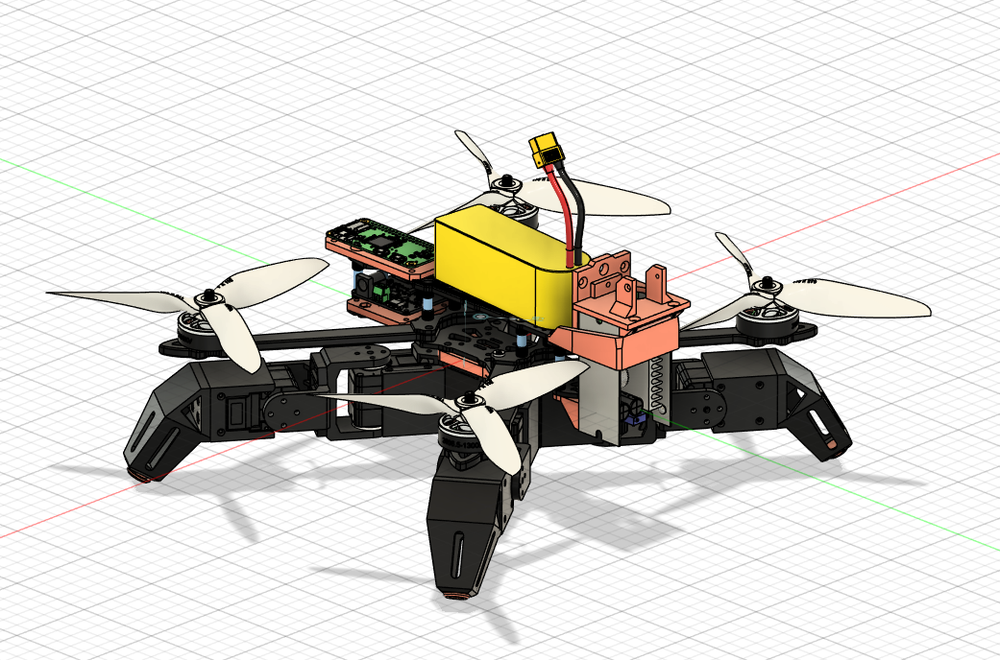
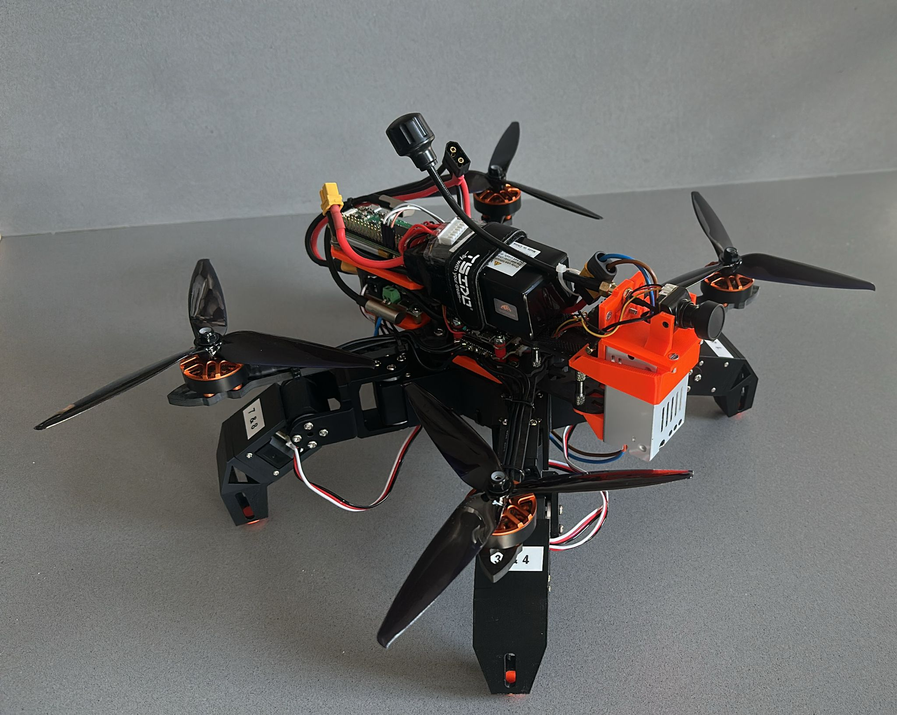

# SpiderBot - Quadruped Robot with Drone Balancing

A hybrid quadruped robot that uses a drone's flight controller and motors to provide balance and stability while walking on servo-controlled legs.





## Overview

The SpiderBot combines the precision of servo-controlled walking gaits with the dynamic stability of a quadcopter. The drone's flight controller maintains balance and orientation while the robot walks, creating a unique hybrid locomotion system.

### Key Features

- **Hybrid Locomotion**: Combines servo-controlled legs with drone balancing
- **Real-time Control**: RC stick input controls walking direction and height
- **Dynamic Stability**: Flight controller maintains balance during walking
- **Web Interface**: Built-in web UI for servo configuration and testing
- **MSP Integration**: Communicates with flight controller via MSP protocol

## Media

### Takeoff Sequence


### Walking with Telemetry


## Bill of Materials

### Flight Control & Power
- **1x** F405 Flight Controller
- **1x** 4-in-1 ESC
- **4x** 1300kV BLDC Motors
- **1x** 6S LiPo Battery
- **1x** DC/DC Buck Converter (6S to ~10V) - *FC could also handle this*

### Frame & Structure
- **1x** 7-inch Quadcopter Frame
- **1x** Raspberry Pi Zero W

### Servo System
- **8x** Waveshare ST3215HS Servos
- **1x** Waveshare Serial Bus Servo Driver Board

### FPV & Control
- **1x** FPC Camera
- **1x** VTX (Video Transmitter)
- **1x** FrSky R-XSR Receiver

## How It Works

### Gait System

The SpiderBot uses a diagonal gait pattern where legs move in coordinated pairs:

1. **Diagonal Pairs**: Front-Left + Rear-Right, Front-Right + Rear-Left
2. **Stance Phase**: Supporting legs maintain body height and provide forward/backward motion
3. **Swing Phase**: Moving legs lift, advance, and lower to new positions
4. **Continuous Cycle**: Legs alternate between stance and swing phases

The gait is implemented in `servos/webInterface/motion_controller.py` and supports:
- Forward/Backward walking
- Left/Right crabbing (strafing)
- Pivot turns (in-place rotation)
- Variable height control
- Adjustable step length and timing

### Drone Balancing

The key innovation is using the drone's flight controller to maintain balance:

- **I-term Disabled**: The flight controller's integral term is set to 0 in walking mode to prevent windup
- **Attitude Control**: The FC maintains level orientation while the robot walks
- **Dynamic Compensation**: Motors provide thrust to counteract walking-induced tilts
- **Stability**: The quadcopter's inherent stability compensates for the walking motion

### Control Flow

1. **RC Input**: Pilot controls via RC transmitter
2. **MSP Communication**: Raspberry Pi reads RC channels via MSP protocol
3. **Gait Generation**: Python scripts generate servo positions for walking
4. **Servo Control**: Waveshare driver board controls leg servos
5. **Balance Control**: Flight controller maintains robot orientation
6. **Feedback Loop**: Continuous adjustment of both servo positions and drone attitude

## Software Architecture

### Core Components

- **`rc_drive.py`**: Main control script that polls RC input and drives servos
- **`motion_controller.py`**: Gait generation and servo coordination
- **`servo_manager.py`**: Low-level servo communication
- **`poll_stick.py`**: RC channel debugging tool

### Web Interface

The included web interface (`servos/webInterface/`) provides:
- Real-time servo monitoring
- Manual servo control
- Gait parameter adjustment
- System diagnostics

## Getting Started

### Prerequisites

- Python 3.8+
- pyserial
- Flask (for web interface)

### Installation

1. Clone the repository
2. Install dependencies:
   ```bash
   pip install -r requirements.txt
   ```

### Running the Robot

1. **Basic RC Control**:
   ```bash
   python rc_drive.py --msp-port COM4 --servo-port COM3 --log-rc
   ```

2. **Web Interface**:
   ```bash
   cd servos/webInterface
   python app.py
   ```

3. **Manual Gait Testing**:
   ```bash
   cd servos/scripts
   python diag_gait.py --port COM3 --cycles 5
   ```

### RC Channel Mapping

- **Channel 6**: Left/Right strafing (crab walk)
- **Channel 7**: Forward/Backward movement
- **Channel 8**: Pivot turns (in-place rotation)
- **Channel 9**: Height control (0-60mm)
- **Channel 10**: Activation switch (low = ON, high = OFF)

## Configuration

### Servo Ranges

Edit `servos/servo_ranges.json` to calibrate servo limits and center positions for your specific hardware.

### Gait Parameters

Adjust walking behavior via command-line options:
- `--speed`: Servo movement speed
- `--step`: Step length in mm
- `--stride-time`: Time for complete gait cycle
- `--lift`: Leg lift height during swing phase

## Technical Details

### MSP Protocol

The system communicates with the flight controller using the MSP (MultiWii Serial Protocol) to read RC channel data in real-time.

### Servo Communication

Uses Waveshare's serial bus protocol for coordinated servo control with the ST3215HS servos.

### Safety Features

- Automatic height adjustment when inactive
- Graceful shutdown on disconnect
- Servo range limiting
- Emergency stop capability

## Troubleshooting

### Common Issues

1. **Variable RC Channel Count**: Ensure MSP communication is stable
2. **Servo Jitter**: Check power supply and servo ranges
3. **Balance Issues**: Verify FC I-term is disabled in walking mode
4. **Communication Errors**: Check serial port permissions and connections

### Debugging

Use `--log-rc` flag to monitor RC channel values:
```bash
python rc_drive.py --log-rc
```

## Future Enhancements

- Autonomous navigation
- Obstacle avoidance
- Improved gait algorithms
- Telemetry logging
- Multi-robot coordination

## License

This project is open source. See individual component licenses for details.

